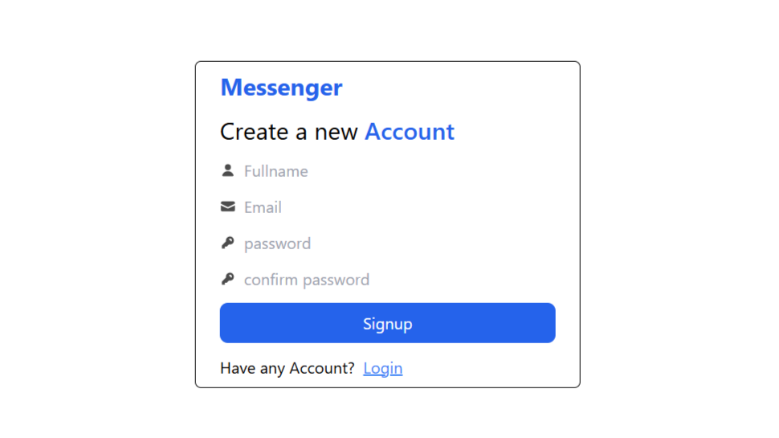
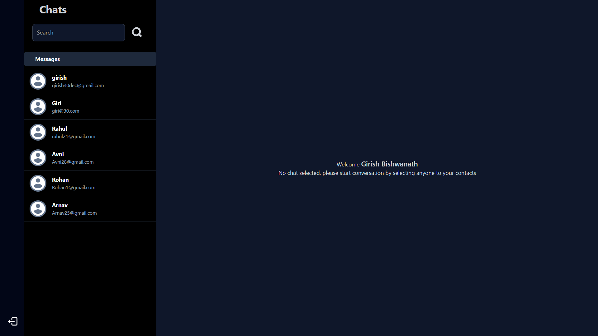
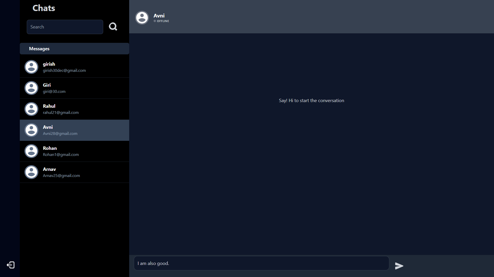
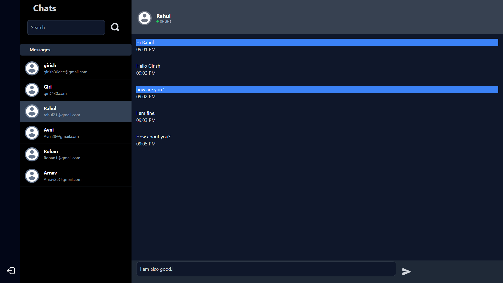

# 💬 Real-Time MERN Chat Application

A full-stack real-time messaging platform enabling seamless communication with live updates and secure authentication.

---

## 🚀 Key Features

- **Real-Time Messaging:** Implemented using **Socket.IO** for instant message delivery and live user connectivity.
- **Online User Tracking:** Maintains active user sessions and dynamically updates online/offline status.
- **Secure Authentication:** Built using **JWT with HTTP-only cookies** and **bcrypt hashing** for safe user authentication.
- **Scalable Backend APIs:** Designed RESTful APIs for user management, conversations, and messaging.
- **Optimized Performance:** Improved backend efficiency using parallel asynchronous operations (`Promise.all`) for database writes.
- **Efficient Data Modeling:** Structured chat system using **Conversation and Message schemas** for scalable data handling.
- **Modern Frontend Architecture:** Built with React using **Context API and custom hooks** for clean state management.
- **Responsive UI:** Designed chat interface with Tailwind CSS including user list, chat window, and message threads.

---

## 📸 Screenshots

### 🔐 Authentication


### 💬 Chat Interface

| No Chat Selected | User Offline |
|------------------|-------------|
|  |  |

### ⚡ Real-Time Messaging


---

## 🛠️ Tech Stack

- **Frontend:** React.js, Tailwind CSS, Axios  
- **Backend:** Node.js, Express.js, Socket.IO  
- **Database:** MongoDB (Mongoose ODM)  
- **Authentication:** JWT, Bcrypt  

---

## 📁 Project Structure

```bash
/frontend → React application (Vite)
/backend → Express server, APIs, and Socket.IO logic
```

---

## ⚙️ Setup & Installation
1. Clone the repository
```bash
git clone https://github.com/GirishBishwanath/MERN-Chat-App
```

2. Install dependencies
```bash
cd frontend && npm install
cd ../backend && npm install
```

3. Configure environment variables
Create `.env` files in both folders:

- **Backend:** `JWT_TOKEN`, `MONGO_URI`
- **Frontend:** API base URL (if needed)

4. Run the application
```bash
# Backend
npm start

# Frontend
npm run dev
```