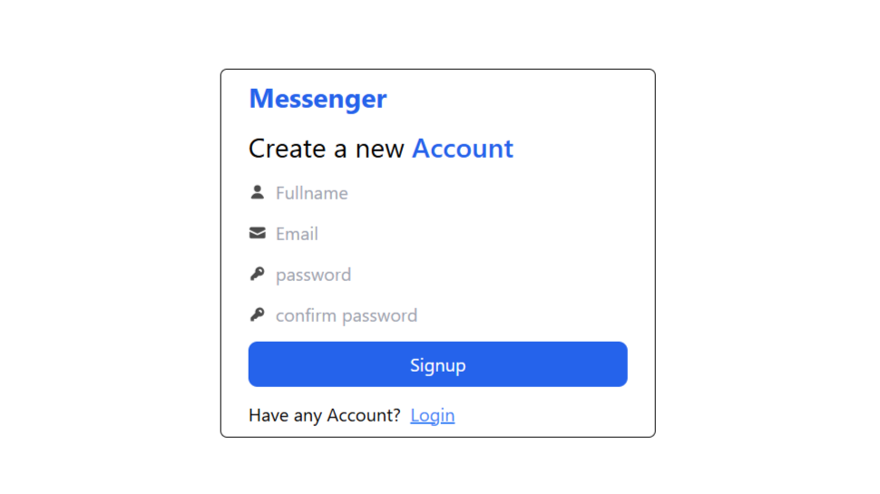
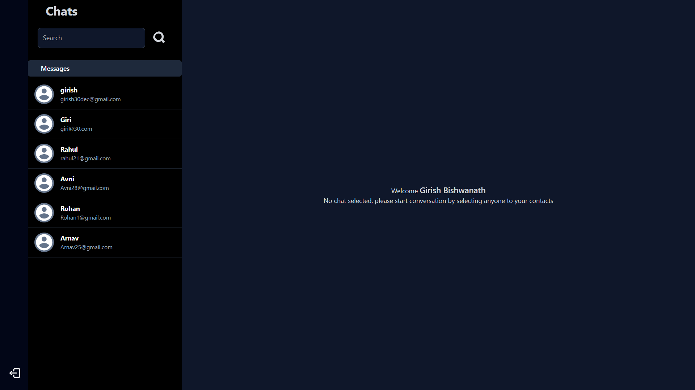
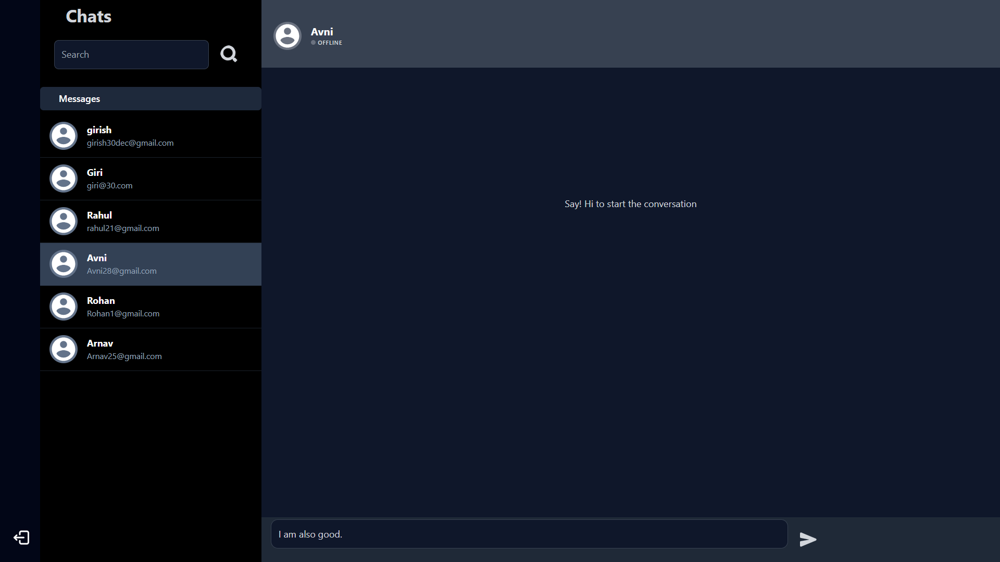
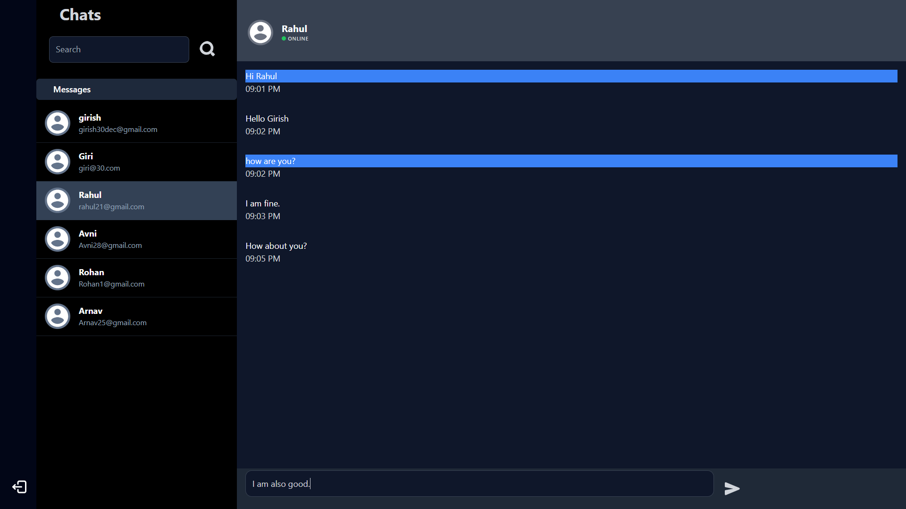

# 💬 Real-Time MERN Chat Application


A full-stack real-time messaging platform enabling seamless communication with live updates and secure authentication.

🔗 **Live Demo:** [mern-chat-app-jade.vercel.app](https://mern-chat-app-jade.vercel.app)
📦 **Repo:** [github.com/GirishBishwanath/MERN-Chat-App](https://github.com/GirishBishwanath/MERN-Chat-App)

---

## 🚀 Key Features

- **Real-Time Messaging:** Implemented using **Socket.IO** for instant message delivery and live user connectivity.
- **Online User Tracking:** Maintains active user sessions and dynamically updates online/offline status.
- **Secure Authentication:** Built using **JWT with HTTP-only cookies** and **bcrypt hashing** for safe user authentication.
- **Scalable Backend APIs:** Designed RESTful APIs for user management, conversations, and messaging.
- **Optimized Performance:** Improved backend efficiency using parallel asynchronous operations (`Promise.all`) for database writes.
- **Efficient Data Modeling:** Structured chat system using **Conversation and Message schemas** for scalable data handling.
- **Modern Frontend Architecture:** Built with React using **Context API and custom hooks** for clean state management.
- **Responsive UI:** Designed chat interface with Tailwind CSS including user list, chat window, and message threads.

---

## 📸 Screenshots

### 🔐 Authentication


### 💬 Chat Interface

| No Chat Selected | User Offline |
|------------------|-------------|
|  |  |

### ⚡ Real-Time Messaging


---

## 🛠️ Tech Stack

- **Frontend:** React.js, Tailwind CSS, Axios
- **Backend:** Node.js, Express.js, Socket.IO
- **Database:** MongoDB (Mongoose ODM)
- **Authentication:** JWT, Bcrypt

---

## ☁️ Deployment

- **Frontend:** Vercel
- **Backend:** Railway — chosen over serverless platforms because Socket.IO requires a persistent, long-running connection that serverless functions don't support
- **Database:** MongoDB Atlas

---

## 📁 Project Structure

```bash
ChatApp/
├── README.md
├── assets/
│   └── (screenshots and static images)
├── Backend/
│   ├── index.js
│   ├── package.json
│   ├── controller/
│   │   ├── message.controller.js
│   │   └── user.controller.js
│   ├── jwt/
│   │   └── generateToken.js
│   ├── middleware/
│   │   └── secureRoute.js
│   ├── models/
│   │   ├── conversation.model.js
│   │   ├── message.model.js
│   │   └── user.model.js
│   ├── routes/
│   │   ├── message.route.js
│   │   └── user.route.js
│   └── SocketIO/
│       └── server.js
└── Frontend/
    ├── index.html
    ├── package.json
    ├── postcss.config.js
    ├── tailwind.config.js
    ├── vite.config.js
    ├── vercel.json
    ├── public/
    └── src/
        ├── App.jsx
        ├── index.css
        ├── main.jsx
        ├── assets/
        ├── components/
        │   ├── Loading.jsx
        │   ├── Login.jsx
        │   └── Signup.jsx
        ├── context/
        │   ├── AuthProvider.jsx
        │   ├── SocketContext.jsx
        │   ├── useGetAllUsers.jsx
        │   ├── useGetMessage.js
        │   ├── useGetSocketMessage.js
        │   └── useSendMessage.js
        ├── home/
        │   ├── left1/
        │   │   └── Logout.jsx
        │   ├── Leftpart/
        │   │   ├── Left.jsx
        │   │   ├── Search.jsx
        │   │   ├── User.jsx
        │   │   └── Users.jsx
        │   └── Rightpart/
        │       ├── Chatuser.jsx
        │       ├── Message.jsx
        │       ├── Messages.jsx
        │       ├── Right.jsx
        │       └── Typesend.jsx
        └── statemanage/
            └── useConversation.js
```

---

## ⚙️ Setup & Installation

1. Clone the repository
```bash
git clone https://github.com/GirishBishwanath/MERN-Chat-App
```

2. Install dependencies
```bash
cd Backend && npm install
cd ../Frontend && npm install
```

3. Configure environment variables

Create a `.env` file inside `Backend/`:
```env
PORT=4002
MONGODB_URI=your_mongodb_connection_string
JWT_TOKEN=your_jwt_secret_key
```

> ⚠️ Never commit your `.env` file. It is already included in `.gitignore`.

If your frontend calls the API via an environment variable, create a `.env` file inside `Frontend/`:
```env
VITE_API_BASE_URL=http://localhost:4002
```

4. Run the application
```bash
# Backend
cd Backend
npm start

# Frontend (in a separate terminal)
cd Frontend
npm run dev
```

The backend runs on `http://localhost:4002` and the frontend on `http://localhost:5173` by default.

---

## 🤝 Contributing

Contributions, issues, and feature requests are welcome!

1. Fork the repository
2. Create your feature branch: `git checkout -b feature/your-feature-name`
3. Commit your changes: `git commit -m 'Add some feature'`
4. Push to the branch: `git push origin feature/your-feature-name`
5. Open a Pull Request

---

## 📄 License

This project is licensed under the **MIT License** — see the [LICENSE](LICENSE) file for details.